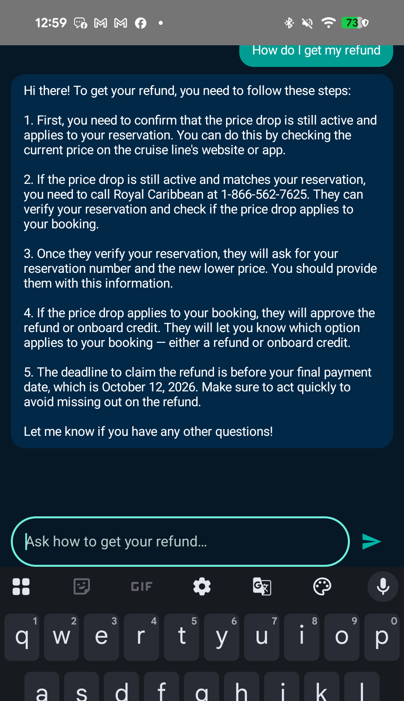

# CruiseWatch

A free, Android-only, CruiseSignal-style cruise fare price-drop tracker with a Wear OS companion and an
on-device AI refund assistant. See [`plan/00-overview.md`](plan/00-overview.md) for the full plan,
architecture, and phase breakdown.

**Website:** https://cruisewatch-app.web.app
**Demo video:** [website/assets/video/cruisewatch-promo.mp4](website/assets/video/cruisewatch-promo.mp4) (also embedded on the website)

## What it does

CruiseWatch watches a cruise you've already booked (same ship, sail date, cabin category) and tells you the
moment the public fare drops below what you paid — then shows you exactly which of your cruise line's
price-protection policies applies and how to claim the refund, onboard credit, or upgrade.

| | |
|---|---|
|  |  |
|  |  |

- **Automatic price checks** against each cruise line's own public pricing — Royal Caribbean, Celebrity,
  Carnival, Princess, and Norwegian, all live-verified.
- **Push alerts** the moment a fare drop falls inside that line's claim window.
- **Exact claim steps** per alert — the real phone number, what to say, and the deadline — sourced from a
  reference policy dataset per cruise line.
- **On-device AI refund assistant** (see below) that already knows your cruises and what to do.
- **Wear OS companion app** (see below) with the same alerts and a full alert-history view, right on your wrist.
- Free — no subscription, no paywalled alerts.

## On-device AI refund assistant

A chat assistant, scoped strictly to helping you get your money back, that runs entirely on-device using
MediaPipe's LLM Inference API with a locally downloaded LiteRT Qwen2.5 model (0.5B or 1.5B, auto-selected from
your device's RAM). Nothing you ask it — or any of your cruise data — ever leaves your phone.

Open it from the bottom nav for general questions, or tap **"Ask the assistant about this"** directly from a
price alert — it opens already knowing the ship, sail date, drop amount, and applicable policy, and leads with
concrete next steps instead of asking what you mean.

| | |
|---|---|
|  |  |

## Wear OS companion

Installed automatically alongside the phone app (bundled via Play Store install-time delivery — no separate
download or setup step). Sign in with the same account or with Google in one tap.

- Live price-drop sync directly over the internet, with a Bluetooth Data Layer fallback for watches that
  aren't independently online.
- Same push notifications as the phone app.
- Tap any tracked cruise to see its full alert history.

| | | |
|---|---|---|
|  |  |  |

## Layout

```
app/       Android Kotlin project — phone app, incl. ai/ (on-device LLM assistant)
wear/      Wear OS companion app (Kotlin, Wear Compose)
scraper/   Node/TypeScript scraper + GitHub Actions workflow (Phase 1/3)
website/   Marketing site, deployed via Firebase Hosting (firebase deploy --only hosting)
docs/      Firestore schema, cruise-line policy reference data
plan/      Plan, one file per phase
```

## Status

- Phase 0 (skeleton & data model): done — see [`plan/01-phase0-skeleton.md`](plan/01-phase0-skeleton.md)
- Phase 1 (Royal Caribbean + Celebrity scraping): done, both lines live-verified — see [`plan/02-phase1-rc-celebrity-scraping.md`](plan/02-phase1-rc-celebrity-scraping.md)
- Phase 2 (Android app MVP): done, builds successfully, Firebase infra live, CI verified green — see [`plan/03-phase2-android-app.md`](plan/03-phase2-android-app.md)
- Phase 3 (Carnival, Princess, Norwegian scraping): done, all 3 lines live-verified — see [`plan/04-phase3-remaining-lines.md`](plan/04-phase3-remaining-lines.md)
- Wear OS companion app, home screen widget, and on-device AI refund assistant: done, live-verified on
  emulator and real hardware (Pixel 8 Pro).

**All 5 cruise lines are now fully implemented and live-verified.** Next up: Phase 4 (Play Store readiness).

## Live infrastructure

- GitHub: [chartmann1590/cruise-monitor](https://github.com/chartmann1590/cruise-monitor) (private)
- Firebase project: `cruisewatch-app`
- Website: https://cruisewatch-app.web.app (Firebase Hosting)
- Android app ID: `com.cruisewatch.app` · Wear app ID: `com.cruisewatch.app.wear`
