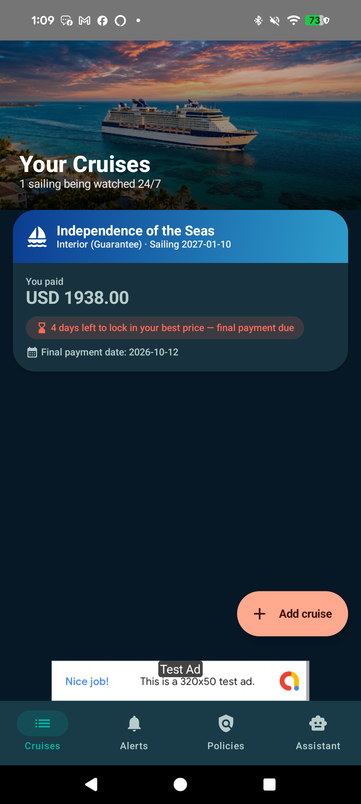
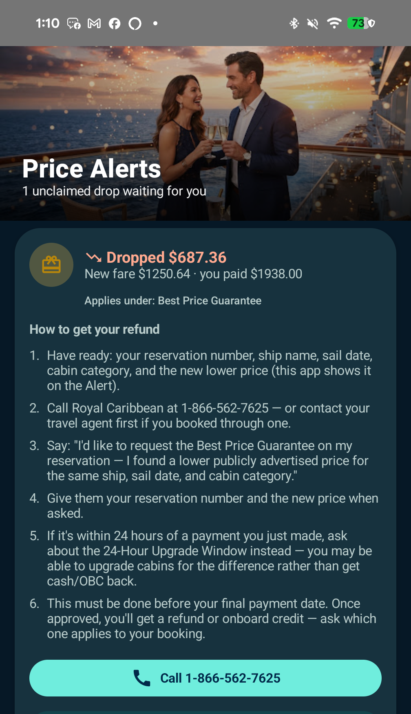
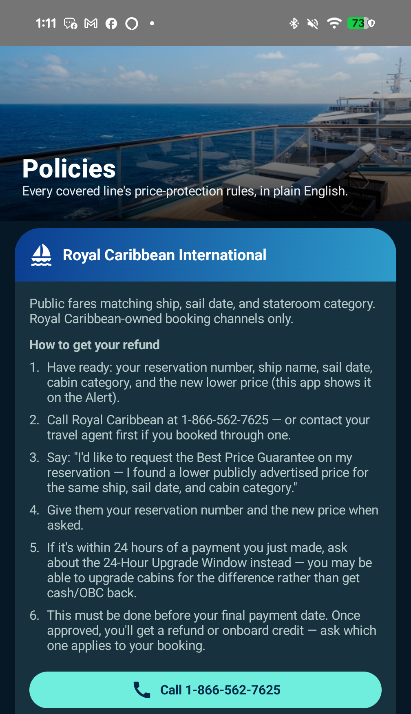
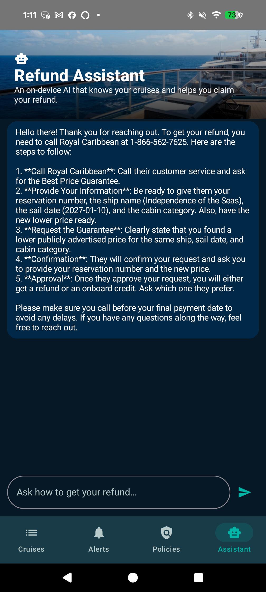
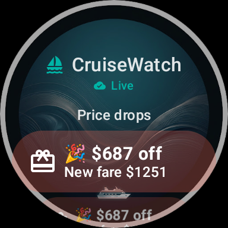
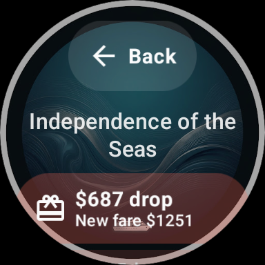
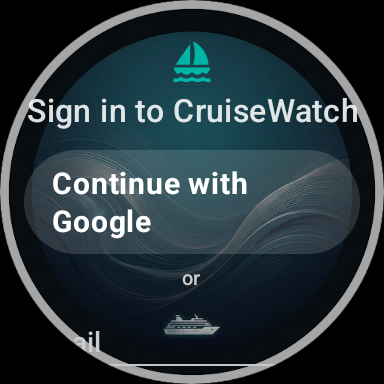

# 🚢 CruiseWatch — Get Money Back When Your Cruise Fare Drops

**You already booked your cruise. But what happens when the price drops a week later?**  
Unless someone tells you, you might miss out on hundreds of dollars in refunds or onboard credits. 

**CruiseWatch** monitors the public fares on cruises you've already booked and sends you an instant push alert the moment the price drops below what you paid. Even better, it gives you exact, step-by-step instructions on who to call, what to say, and how to claim your refund before the window closes.

🌐 **Website:** [cruisewatch-app.web.app](https://cruisewatch-app.web.app)  
🎥 **Watch the Promo Video:** [Click here to view the video](website/assets/video/cruisewatch-promo.mp4) (also streaming live on our [website](https://cruisewatch-app.web.app))  
🍺 **Support Developer:** [Buy Me a Beer / Coffee](https://www.buymeacoffee.com/charleshartmann)

---

## 📸 App Screenshots

### 📱 Android Phone App

| Your Tracked Cruises | Price Drop Alerts & Claim Steps |
|:---:|:---:|
|  |  |

| Cruise Line Policy Reference | On-Device AI Refund Assistant |
|:---:|:---:|
|  |  |

---

### ⌚ Wear OS Smartwatch Companion
Get your price drops and sailing status delivered straight to your wrist!

| Price Drops on Wrist | Claim & Alert History | One-Tap Sign In |
|:---:|:---:|:---:|
|  |  |  |

---

## ✨ How It Works (In 3 Simple Steps)

1. **Add Your Booked Cruise:**  
   Select your cruise line, ship name, sailing date, and cabin category. Enter the fare you paid—no booking confirmation numbers or sensitive account details required.
2. **We Watch Public Fares 24/7:**  
   Our automated system checks public rates several times a day across major cruise lines:
   * **Royal Caribbean**
   * **Celebrity Cruises**
   * **Carnival Cruise Line**
   * **Princess Cruises**
   * **Norwegian Cruise Line (NCL)**
3. **Get Alerted & Claim Your Refund:**  
   The instant a lower price appears for your room category, you receive a notification. Open the alert to see the exact phone number to call, a ready-to-read script, and your cruise line's official price protection deadline.

---

## 🤖 Built-In AI Refund Assistant (100% Private & Offline)

Have questions about your booking or how price adjustments work?  
CruiseWatch features an intelligent on-device refund assistant:
* **Zero Tracking:** The AI assistant runs entirely on your phone. None of your questions, cruise details, or personal information ever leave your device.
* **Instant Context:** Tap *"Ask the assistant about this"* directly from any price alert, and it automatically provides guidance tailored to your specific ship, sailing date, and cruise line policy.

---

## 🔒 Privacy First

CruiseWatch is built with your privacy at the center:
* **No Travel Agent Needed:** You don't need to transfer your booking or give us your reservation credentials.
* **No Hidden Fees:** 100% free to use, supported by standard unobtrusive ads.
* **Full Data Control:** Easily delete your tracked cruises, history, or your entire account at any time directly in Settings or via our [Account Deletion Page](https://cruisewatch-app.web.app/delete-account.html).
* Read our full [Privacy Policy](https://cruisewatch-app.web.app/privacy.html) and [Terms of Service](https://cruisewatch-app.web.app/terms.html).

---

## 🍺 Support the Developer

CruiseWatch is independently built and maintained with ❤️. If CruiseWatch helped you save money or get onboard credit for your next vacation, consider supporting future development:

👉 **[Buy Me a Beer / Coffee on BuyMeACoffee](https://www.buymeacoffee.com/charleshartmann)** 🍻

Every contribution helps keep the servers running and new cruise lines coming!

---

## 🐛 Need Help or Found a Bug?

We'd love to hear from you! If you run into an issue, notice pricing that doesn't look right, or want to request a new cruise line:
* **Open an Issue:** Please [open an issue on GitHub](https://github.com/chartmann1590/cruise-monitor/issues/new) with details.
* **Email Support:** Reach out directly at [me@charleshartmann.com](mailto:me@charleshartmann.com).

---

## 🌟 Check Out Our Other Apps!

Enjoying CruiseWatch? Take a look at these other handy apps from **Hartmann Studios**:

* **🍻 [TipsyBuddy](https://github.com/chartmann1590/TipsyBuddy)** — Your smart night-out wingman & drink tracker. Monitor estimated BAC, stay hydrated, check in to bars, and share your live location so friends know you're safe. ([Live Web Tracker](https://tipsybuddy.web.app))
* **📰 [Porchlight Press](https://github.com/chartmann1590/porchlight-press)** — A clean, privacy-first personalized local newspaper for Android with real-time weather forecasts, source-attributed briefs, and read-aloud features.
* **🎨 PixelDream** — Fast, completely private on-device AI art generator for Android.
* **💚 WarmWord** — A calm, on-device AI companion for mental health reflection and mood journaling that stays strictly on your phone.

---

*Disclaimer: CruiseWatch is an independent price monitoring utility and is not affiliated with, endorsed by, or sponsored by Royal Caribbean, Celebrity Cruises, Carnival, Princess, Norwegian Cruise Line, or any other cruise line. All cruise line names and trademarks belong to their respective owners.*
